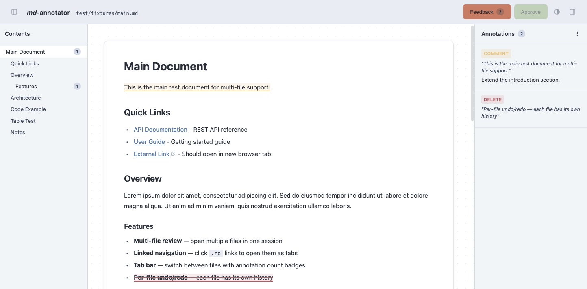

# md-annotator

An AI coding agent plugin that opens Markdown files in a local browser-based annotator. Select text to mark deletions or add comments, then let the coding agent apply your feedback.

> [!NOTE]
> This plugin is heavily inspired by the excellent [plannotator](https://plannotator.ai/) plugin and uses a similar general approach for Markdown files. Useful for creating and reviewing documentation in software projects.



## ✨ Features

- [Claude Code Plugin](#-claude-code-plugin)
- [OpenCode Plugin](#-opencode-plugin)
- [Standalone CLI](#-standalone-cli)

## 🔌 Claude Code Plugin

*md-annotator* is a Claude Code plugin. After installation the slash command `/annotate:md` is available in any Claude Code session.

### 📦 Installation

```bash
# Add the marketplace
claude plugin marketplace add konradmichalik/md-annotator

# Install the plugin
claude plugin install annotate@md-annotator --scope user
```

For local development, see the [Development](#-development) section.

### 🚀 Usage

Inside a Claude Code session:

```
/annotate:md README.md
```

Or, with IDE integration (VSCode/Cursor/JetBrains), just run without arguments to annotate the currently open file:

```
/annotate:md
```

This opens the file in your browser. You can then:

- **Select text** to see the annotation toolbar
- **Delete** — marks text as struck-through (red)
- **Comment** — highlights text (yellow) and adds a comment
- **View annotations** in the sidebar panel on the right
- **Approve** or **Submit Feedback** when done

If no file argument is given, the command looks for `plan.md` in the current directory.

## 🔷 OpenCode Plugin

*md-annotator* is also available as an OpenCode plugin.

### 📦 Installation

Add to your `opencode.json`:

```json
{
  "plugins": ["@md-annotator/opencode"]
}
```

### 🚀 Usage

The agent can use the `annotate_markdown` tool:

```
annotate_markdown({ filePath: "/path/to/file.md" })
```

Or use the `/annotate:md` command in the chat.

## 💻 Standalone CLI

*md-annotator* also works as a standalone CLI tool without an AI coding agent:

```bash
# Run directly
node index.js README.md

# Or link globally
npm link
md-annotator README.md

# Show help
md-annotator --help
```

The server starts on an available port (default 3000) and opens your browser automatically.

### Environment Variables

| Variable | Description |
|----------|-------------|
| `MD_ANNOTATOR_PORT` | Override the server port (default: 3000) |
| `MD_ANNOTATOR_BROWSER` | Custom browser application |

## 🛠️ Development

```bash
# Clone and build
git clone https://github.com/konradmichalik/md-annotator.git
cd md-annotator
npm install && npm run build

# Install local plugin for testing
claude plugin install ./apps/claude-code --scope user

# Development commands
npm run dev:client   # Vite dev server with HMR (client only)
npm run build        # Production build (single-file HTML)
npm run dev          # CLI with --watch

# Test plugin without permanent installation
claude --plugin-dir ./apps/claude-code
```

## 📄 License

MIT
