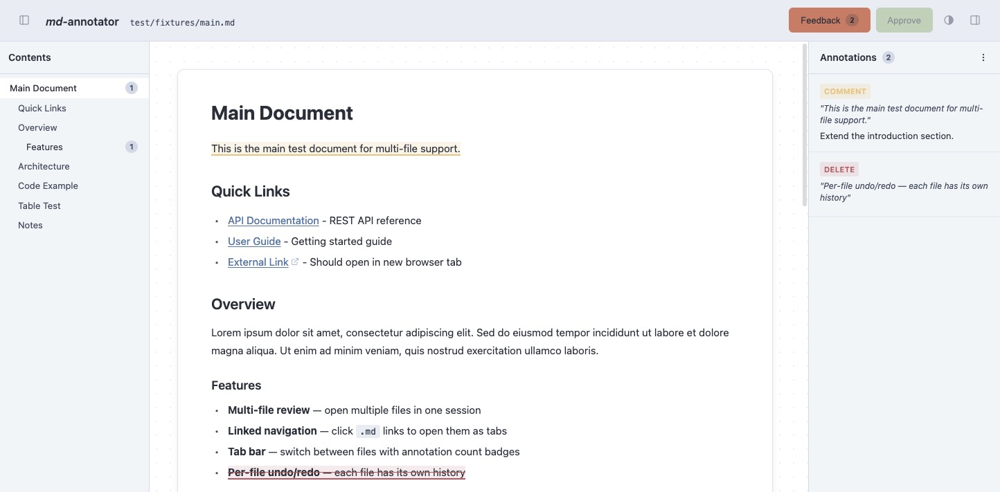

<p align="center">
  <picture>
    <source media="(prefers-color-scheme: dark)" srcset="docs/images/logo-dark.png">
    <source media="(prefers-color-scheme: light)" srcset="docs/images/logo-light.png">
    
  </picture>
</p>

<p align="center">
  An AI coding agent plugin that opens Markdown files in a local browser-based annotator.<br>
  Select text to mark deletions or add comments, then let the coding agent apply your feedback.
</p>

> [!NOTE]
> This plugin is heavily inspired by the excellent [plannotator](https://plannotator.ai/) plugin and uses a similar general approach for Markdown files. Useful for reviewing documentation in software projects.



## ✨ Features

- **Multi-File Support** -- Review multiple files in one session with a tabbed interface
- **Linked Navigation** -- Click relative `.md` links to open them as new tabs (wiki-style browsing)
- **Mermaid Diagrams** -- Renders `mermaid` code blocks as interactive diagrams with zoom, pan, and source toggle (adapts to light/dark theme)
- **PlantUML Diagrams** -- Renders `plantuml` code blocks as SVG via a configurable PlantUML server with zoom, pan, and source toggle
- **Kroki Diagrams** -- Renders 27+ diagram formats (`graphviz`, `d2`, `ditaa`, `erd`, `nomnoml`, `excalidraw`, and more) via a configurable [Kroki](https://kroki.io) server
- **File References** -- Type `@` in comments to autocomplete and reference other project files
- **Export & Import** -- Export annotations as Markdown or JSON; re-import JSON to continue a review later
- **Annotation Persistence** -- Annotations auto-save to the server and survive page reloads (validated by content hash)
- **Undo / Redo** -- Full undo/redo history for annotations (`Cmd+Z` / `Cmd+Shift+Z`)
- **Quick Labels** -- Categorize annotations instantly with 10 predefined labels (`Alt+1`--`0`) shown as colored pills with SVG icons
- **Inline Editing** -- Click highlighted text to edit annotation type or comment in-place
- **Table of Contents** -- Collapsible sidebar with scroll tracking and per-section annotation count badges
- **Syntax Highlighting** -- Code blocks rendered with highlight.js
- **Dark Mode** -- Light, dark, and auto theme (follows system preference)
- **Auto-Close Tab** -- Opt-in countdown that closes the browser tab after submitting feedback
- **Update Notifications** -- Banner when a new GitHub release is available
- **Heartbeat Detection** -- Graceful shutdown when the browser tab is closed
- **IDE Integration** -- Annotate the currently open file in VSCode, Cursor, or JetBrains without arguments
- **Iterative Review** -- AI agent applies your feedback and re-opens the annotator for another review round until you approve

## 📋 Prerequisites

- **Node.js** 22+ and **npm**
- A modern **browser** (opens automatically)

## 🔗 Integrations

*md-annotator* supports the following integrations:

- [**Claude Code**](#-claude-code-plugin) -- Plugin with `/annotate:md` slash command
- [**OpenCode**](#-opencode-plugin) -- Plugin with `annotate_markdown` tool and `/annotate:md` command
- [**Standalone CLI**](#-standalone-cli) -- Use directly from the terminal without an AI agent

## 🔌 Claude Code Plugin

*md-annotator* is a Claude Code plugin. After installation the slash command `/annotate:md` is available in any Claude Code session.

### 📦 Installation & Update

Native Claude Code plugin commands:

```bash
claude plugin marketplace add konradmichalik/md-annotator
claude plugin install annotate@md-annotator
```

Or via the installer script (also installs the standalone CLI):

```bash
curl -fsSL https://konradmichalik.github.io/md-annotator/install.sh | bash
```

### 🚀 Usage

Inside a Claude Code session:

```
/annotate:md README.md
/annotate:md docs/api.md docs/guide.md
```

Or, with IDE integration (VSCode/Cursor/JetBrains), just run without arguments to annotate the currently open file:

```
/annotate:md
```

## 🔷 OpenCode Plugin

*md-annotator* is also available as an OpenCode plugin.

### 📦 Installation & Update

```bash
curl -fsSL https://konradmichalik.github.io/md-annotator/install.sh | bash
```

Then add to your `opencode.json`:

```json
{
  "plugin": ["md-annotator-opencode@latest"]
}
```

> [!NOTE]
> See [OpenCode documentation](https://opencode.ai/docs/plugins) for more details.

### 🚀 Usage

Use the `/annotate:md` command in the chat:

```
/annotate:md README.md
/annotate:md docs/api.md docs/guide.md
```

The agent can also use the `annotate_markdown` tool directly:

```
annotate_markdown({ filePath: "/path/to/file.md" })
annotate_markdown({ filePaths: ["/path/to/a.md", "/path/to/b.md"] })
```

## 💻 Standalone CLI

*md-annotator* also works as a standalone CLI tool without an AI coding agent:

```bash
# Single file
md-annotator README.md

# Multiple files (opens with tab bar)
md-annotator docs/api.md docs/guide.md

# Show help
md-annotator --help
```

The server starts on an available port (default 3000) and opens your browser automatically. When reviewing multiple files, a tab bar appears for switching between them. Clicking relative `.md` links inside a document opens the linked file as a new tab.

### Environment Variables

| Variable               | Description                                                  |
|------------------------|--------------------------------------------------------------|
| `MD_ANNOTATOR_PORT`    | Override the server port (default: 3000)                     |
| `MD_ANNOTATOR_BROWSER` | Custom browser application                                   |
| `PLANTUML_SERVER_URL`  | PlantUML render server (default: `https://www.plantuml.com/plantuml`) |
| `KROKI_SERVER_URL`     | Kroki render server (default: `https://kroki.io`)                    |

> [!NOTE]
> **Privacy**: When rendering PlantUML or Kroki diagrams, the diagram source is encoded and sent to the configured server. The defaults are the public servers at `plantuml.com` and `kroki.io`. If your documents contain sensitive diagrams, self-host a [PlantUML server](https://hub.docker.com/r/plantuml/plantuml-server) or [Kroki server](https://docs.kroki.io/kroki/setup/install/) and set `PLANTUML_SERVER_URL` / `KROKI_SERVER_URL` accordingly.

## 📝 How It Works

Once a file is opened in the browser, you can:

- **Select text** to see the annotation toolbar
- **Delete** -- marks text as struck-through (red)
- **Comment** -- highlights text (yellow) and adds a comment
- **Quick Label** -- click the tag icon or press `Alt+1`--`0` to instantly categorize a selection (Unclear, Rephrase, Factual Error, etc.)
- **Insert** -- place the cursor to add new text at that position
- **Global Comment** -- add general feedback via the "+" button in the annotation panel
- **Annotate images & diagrams** -- click on images, Mermaid, PlantUML, or Kroki diagrams to comment or delete them
- **View annotations** in the sidebar panel on the right
- **Export** annotations as Markdown or JSON
- **Approve** or **Submit Feedback** when done

When used with an AI agent (Claude Code or OpenCode), submitting feedback triggers the agent to apply your changes to the file. The agent then re-opens the annotator for another review round, so you can verify the edits and provide further feedback if needed. This review loop continues until you approve the result.

## 🛠️ Development

See [docs/DEVELOPMENT.md](docs/DEVELOPMENT.md) for setup, build commands, and local plugin testing.

## 📄 License

MIT
