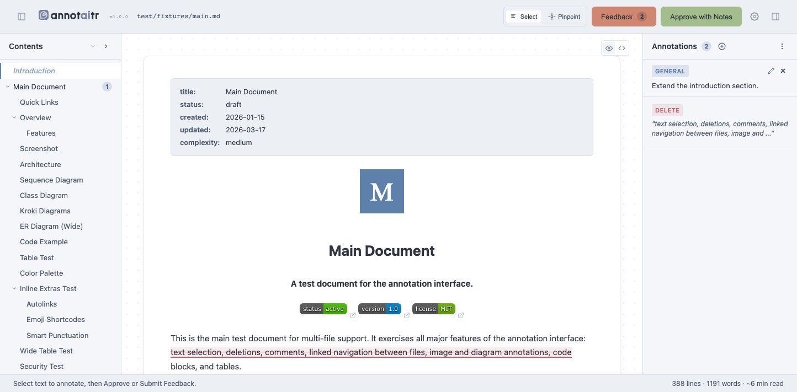

<p align="center">
  <picture>
    <source media="(prefers-color-scheme: dark)" srcset="docs/images/logo-dark.png">
    <source media="(prefers-color-scheme: light)" srcset="docs/images/logo-light.png">
    
  </picture>
</p>

<p align="center">
  An AI coding agent plugin that opens images, captured web pages, or Markdown files in a local browser-based annotator.<br>
  Mark up boxes, arrows, comments, and text selections, then let the coding agent apply your feedback.
</p>

> [!NOTE]
> This plugin is heavily inspired by the excellent [plannotator](https://plannotator.ai/) plugin and uses a similar general approach. Useful for visual UI review and for reviewing documentation in software projects.



> [!IMPORTANT]
> `annotaitr` is the merge of the former `img-annotator` and `md-annotator` projects into one package and plugin, auto-detecting which mode to run based on the target. See [Migrating from md-annotator / img-annotator](#-migrating-from-md-annotator--img-annotator) below if you have either installed already.

## ✨ Features

Which mode runs is auto-detected from the target (a single image file/URL vs. one or more markdown/plain-text files); `--as image` or `--as markdown` forces a mode.

**Image & web page review:**

- **Web Page Capture** -- Captures a full-page screenshot of any `http(s)` URL via Playwright, at a chosen viewport (`desktop`, `laptop`, `tablet`, `mobile`, or a custom `<W>x<H>`)
- **Clipboard Support** -- Run with no target to annotate whatever screenshot is currently on the (macOS) clipboard
- **Drawing Tools** -- Boxes, arrows, freehand marks, and numbered comment pins, each with an optional text comment and a per-annotation color
- **Coarse Position Descriptions** -- Feedback for the agent includes a plain-language position for each annotation (e.g. "top right, ~15% from top"), and calls out annotations positioned close together so the agent knows to check the image itself
- **Annotated Screenshot Export** -- Approving or submitting with annotations bakes the markup into a copy of the image (with a legend) and passes its path to the agent

**Markdown & plain-text review:**

- **Multi-File Support** -- Review multiple files in one session with a tabbed interface
- **Config & Data Files** -- Annotate `.yaml`, `.yml`, `.json`, `.jsonc`, `.json5`, `.toml`, `.ini`, `.cfg`, `.conf`, `.properties`, `.csv`, `.tsv`, `.log`, `.xml`, `.txt`, `.text` and `.env.example` as raw source with line numbers (a real `.env` is rejected, since those hold secrets)
- **Linked Navigation** -- Click relative `.md` links to open them as new tabs (wiki-style browsing); a link to a directory (`docs/routing/`) opens that directory's `README.md` or `index.md`
- **LaTeX Math** -- Renders inline `$…$` / `\(…\)` and display `$$…$$` / `\[…\]` via KaTeX with bundled fonts (works offline); display formulas are annotatable as a whole. Dollar amounts like `$5-$10` and unterminated `$$` stay literal text
- **Mermaid Diagrams** -- Renders `mermaid` code blocks as interactive diagrams with zoom, pan, and source toggle (adapts to light/dark theme)
- **PlantUML Diagrams** -- Renders `plantuml` code blocks as SVG via a configurable PlantUML server with zoom, pan, and source toggle
- **Kroki Diagrams** -- Renders 27+ diagram formats (`graphviz`, `d2`, `ditaa`, `erd`, `nomnoml`, `excalidraw`, and more) via a configurable [Kroki](https://kroki.io) server
- **File References** -- Type `@` in comments to autocomplete and reference other project files
- **Quick Labels** -- Categorize annotations instantly with 10 predefined labels (`Alt+1`--`0`) shown as colored pills with SVG icons
- **Inline Editing** -- Click highlighted text to edit annotation type or comment in-place
- **Table of Contents** -- Collapsible sidebar with scroll tracking and per-section annotation count badges
- **Syntax Highlighting** -- Code blocks rendered with highlight.js
- **Annotation Persistence** -- Annotations auto-save to the server and survive page reloads (validated by content hash)
- **Undo / Redo** -- Full undo/redo history for annotations (`Cmd+Z` / `Cmd+Shift+Z`)

**Both modes:**

- **Export & Import** -- Export annotations as Markdown or JSON; re-import JSON to continue a review later
- **Dark Mode** -- Light, dark, and auto theme (follows system preference)
- **Auto-Close Tab** -- Opt-in countdown that closes the browser tab after submitting feedback
- **Heartbeat Detection** -- Graceful shutdown when the browser tab is closed
- **Iterative Review** -- AI agent applies your feedback and re-opens the annotator for another review round until you approve

## 📋 Prerequisites

- **Node.js** 22+ and **npm**
- A modern **browser** (opens automatically)
- Image mode additionally needs `playwright` and `@napi-rs/canvas` (`optionalDependencies`, installed by default; a markdown-only install can skip them and gets an actionable error if image mode is ever invoked without them)

## 🔗 Integrations

*annotaitr* supports the following integrations:

- [**Claude Code**](#-claude-code-plugin) -- Plugin with `/annotate:md`, `/annotate:image`, and `/annotate:review` slash commands
- [**OpenCode**](#-opencode-plugin) -- Plugin with `annotate_markdown` tool and `/annotate:md` command (markdown only, for now)
- [**Mistral Vibe**](#-mistral-vibe-skill) -- Skill with `/annotate` slash command (markdown only, for now)
- [**Standalone CLI**](#-standalone-cli) -- Use directly from the terminal without an AI agent

## 🔌 Claude Code Plugin

*annotaitr* is a Claude Code plugin (still named `annotate`). After installation, `/annotate:md`, `/annotate:image`, and `/annotate:review` are available in any Claude Code session.

### 📦 Installation & Update

Native Claude Code plugin commands:

```bash
claude plugin marketplace add konradmichalik/annotaitr
claude plugin install annotate@annotaitr
```

Or via the installer script (also installs the standalone CLI):

```bash
curl -fsSL https://konradmichalik.github.io/annotaitr/install.sh | bash
```

### 🚀 Usage

Inside a Claude Code session:

```
/annotate:md README.md
/annotate:md docs/api.md docs/guide.md
/annotate:image ./mockup.png
/annotate:image http://localhost:3000
/annotate:review ./anything      # auto-detects image vs. markdown
```

Or, with IDE integration (VSCode/Cursor/JetBrains), just run without arguments to annotate the currently open file:

```
/annotate:md
```

## 🔷 OpenCode Plugin

*annotaitr* is also available as an OpenCode plugin, markdown-only for now.

### 📦 Installation & Update

```bash
curl -fsSL https://konradmichalik.github.io/annotaitr/install.sh | bash
```

Then add to your `opencode.json`:

```json
{
  "plugin": ["annotaitr-opencode@latest"]
}
```

> [!NOTE]
> See [OpenCode documentation](https://opencode.ai/docs/plugins) for more details.

### 🚀 Usage

Use the `/annotate:md` command in the chat:

```
/annotate:md README.md
/annotate:md docs/api.md docs/guide.md
```

The agent can also use the `annotate_markdown` tool directly:

```
annotate_markdown({ filePath: "/path/to/file.md" })
annotate_markdown({ filePaths: ["/path/to/a.md", "/path/to/b.md"] })
```

## 🔶 Mistral Vibe Skill

*annotaitr* is also available as a [Mistral Vibe](https://github.com/mistralai/mistral-vibe) skill, markdown-only for now. It drives the standalone CLI, so the CLI must be installed first.

### 📦 Installation & Update

```bash
curl -fsSL https://konradmichalik.github.io/annotaitr/install.sh | bash
```

Then make the skill available to Vibe by copying (or symlinking) it into a skill directory Vibe discovers — globally in `~/.vibe/skills/` or per-project in `.vibe/skills/`:

```bash
cp -r apps/vibe/skills/annotate ~/.vibe/skills/annotate
```

> [!NOTE]
> Vibe discovers skills from `~/.vibe/skills/`, `.vibe/skills/`, and any `skill_paths` configured in `config.toml`. See the [Mistral Vibe documentation](https://github.com/mistralai/mistral-vibe#skills-system) for more details.

### 🚀 Usage

Use the `/annotate` command in a Vibe session:

```
/annotate README.md
/annotate docs/api.md docs/guide.md
```

## 💻 Standalone CLI

*annotaitr* also works as a standalone CLI tool without an AI coding agent. Mode is auto-detected from the target:

```bash
# Markdown, single or multiple files (opens with tab bar)
annotaitr README.md
annotaitr docs/api.md docs/guide.md

# Image: local file, or capture a URL
annotaitr ./mockup.png
annotaitr http://localhost:3000
annotaitr --viewport mobile http://localhost:3000/checkout

# No target: reads an image off the clipboard (macOS), or prints help
annotaitr

# Force a mode when detection would guess wrong
annotaitr --as image ./diagram.svg

# Show help
annotaitr --help
```

The server starts on an available port (default 3000) and opens your browser automatically. `md-annotator` still works as an alias for the same binary.

### Environment Variables

| Variable                    | Description                                                  |
|------------------------------|--------------------------------------------------------------|
| `ANNOTAITR_PORT`             | Port or inclusive range (`3000` or `3000-3010`); the first free port in the range wins |
| `ANNOTAITR_HOST`              | Host to bind to (default `127.0.0.1`)                        |
| `ANNOTAITR_BROWSER`           | Custom browser application                                    |
| `ANNOTAITR_TIMEOUT`           | Heartbeat timeout in ms (default `30000`, range `5000`-`300000`) |
| `ANNOTAITR_NO_OPEN`           | Skip opening a browser tab automatically                     |
| `ANNOTAITR_CAPTURE_TIMEOUT`   | Image mode: page-load timeout in ms for URL capture           |
| `ANNOTAITR_FEEDBACK_NOTES`    | Markdown mode: JSON string or file path for feedback notes    |
| `PLANTUML_SERVER_URL`        | PlantUML render server (default `https://www.plantuml.com/plantuml`) |
| `KROKI_SERVER_URL`           | Kroki render server (default `https://kroki.io`)             |

> [!NOTE]
> `MD_ANNOTATOR_*` and `IMG_ANNOTATOR_*` still work as deprecated fallbacks for the corresponding `ANNOTAITR_*` variable, with a one-time warning on stderr.

> [!NOTE]
> **Privacy**: When rendering PlantUML or Kroki diagrams, the diagram source is encoded and sent to the configured server. The defaults are the public servers at `plantuml.com` and `kroki.io`. If your documents contain sensitive diagrams, self-host a [PlantUML server](https://hub.docker.com/r/plantuml/plantuml-server) or [Kroki server](https://docs.kroki.io/kroki/setup/install/) and set `PLANTUML_SERVER_URL` / `KROKI_SERVER_URL` accordingly.

## 📝 How It Works

**Image mode:** click and drag to draw a box, arrow, or freehand mark, or click to drop a numbered comment pin; add an optional comment to each. Approve or Submit Feedback when done — with annotations present, Approve becomes **Approve with Notes** and passes them along as context (with an annotated screenshot) instead of discarding them.

**Markdown mode**, once a file is opened in the browser:

- **Select text** to see the annotation toolbar
- **Delete** -- marks text as struck-through (red)
- **Comment** -- highlights text (yellow) and adds a comment
- **Quick Label** -- click the tag icon or press `Alt+1`--`0` to instantly categorize a selection (Unclear, Rephrase, Factual Error, etc.)
- **Insert** -- place the cursor to add new text at that position
- **Global Comment** -- add general feedback via the "+" button in the annotation panel
- **Annotate images & diagrams** -- click on images, Mermaid, PlantUML, or Kroki diagrams to comment or delete them
- **View annotations** in the sidebar panel on the right
- **Export** annotations as Markdown or JSON
- **Approve** or **Submit Feedback** when done -- with annotations present, Approve becomes **Approve with Notes** and passes them along as context instead of discarding them

When used with an AI agent, submitting feedback triggers the agent to apply your changes. The agent then re-opens the annotator for another review round, so you can verify the edits and provide further feedback if needed. This review loop continues until you approve the result.

## 🔁 Migrating from md-annotator / img-annotator

`annotaitr` is the merge of `img-annotator` and `md-annotator` (this repo, formerly `konradmichalik/md-annotator`) into one package and one plugin.

- **Claude Code**: the marketplace was renamed. Remove the old one and add the new one:
  ```bash
  claude plugin marketplace remove md-annotator   # or img-annotator
  claude plugin marketplace add konradmichalik/annotaitr
  claude plugin install annotate@annotaitr
  ```
  The plugin itself is still named `annotate`, so `/annotate:md` keeps working; `/annotate:image` and `/annotate:review` are new.
- **CLI**: `npm install -g annotaitr`. `md-annotator` keeps working as a `bin` alias for existing scripts and shell aliases; `img-annotator` was never published, so there's no alias for it.
- **Environment variables**: `MD_ANNOTATOR_*` and `IMG_ANNOTATOR_*` still work, with a deprecation warning, under the merged `ANNOTAITR_*` prefix. See the table above.
- **Signal handling**: interrupting a markdown-mode session (Ctrl+C) now reports `{ aborted: true }` to the calling agent instead of the previous `{ approved: true }`, so an interrupt is no longer indistinguishable from a real approval.
- **OpenCode / Vibe**: `md-annotator-opencode` is now `annotaitr-opencode`; the vibe skill directory is now `apps/vibe/skills/annotate`. Both stay markdown-only for now.

## 🛠️ Development

See [docs/DEVELOPMENT.md](docs/DEVELOPMENT.md) for setup, build commands, and local plugin testing.

## 📄 License

MIT
