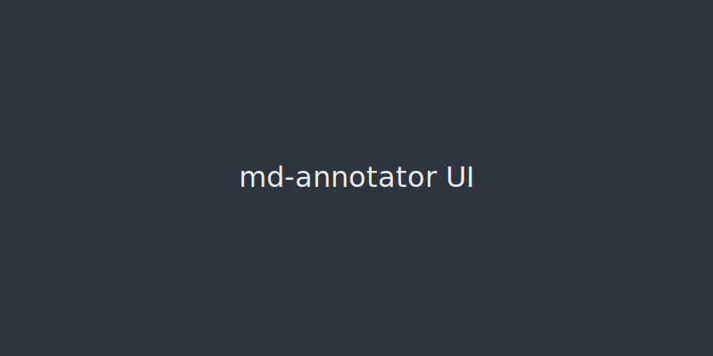
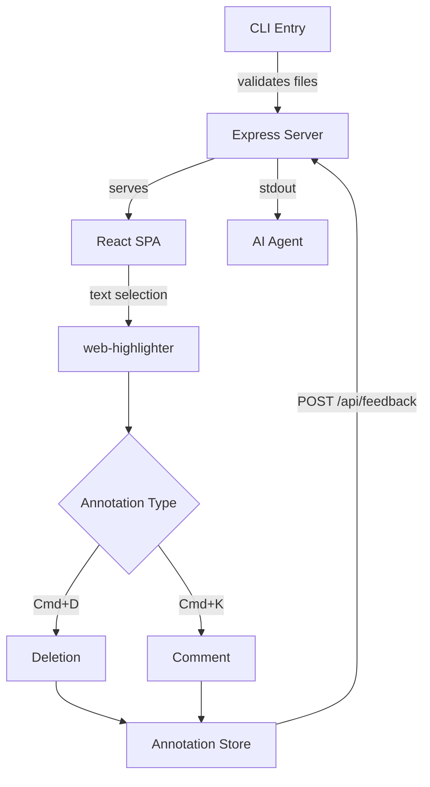

# Main Document

This is the main test document for multi-file support.

## Quick Links

- [API Documentation](./docs/api.md) - REST API reference
- [User Guide](./docs/guide.md) - Getting started guide
- [External Link](https://example.com) - Should open in new browser tab

## Overview

Lorem ipsum dolor sit amet, consectetur adipiscing elit. Sed do eiusmod tempor incididunt ut labore et dolore magna aliqua. Ut enim ad minim veniam, quis nostrud exercitation ullamco laboris.

### Features

- **Multi-file review** — open multiple files in one session
- **Linked navigation** — click `.md` links to open them as tabs
- **Tab bar** — switch between files with annotation count badges
- **Per-file undo/redo** — each file has its own history

## Screenshot

Here is a preview of the annotation interface:



You can also see inline images like this: The logo  appears next to the title.

## Architecture



## Code Example

```javascript
const server = await createServer(['file1.md', 'file2.md'])
const decision = await server.waitForDecision()
```

## Table Test

| Feature         | Status      |
|-----------------|-------------|
| Multi-file CLI  | Implemented |
| Tab bar         | Implemented |
| Linked nav      | Implemented |
| Path security   | Implemented |

## Notes

This paragraph contains some text you can **annotate for testing**. Try selecting different portions and marking them as deletions or adding comments.

> This blockquote can also be annotated. Try selecting just part of it.

---

See also the [API docs](./docs/api.md) for more details.
